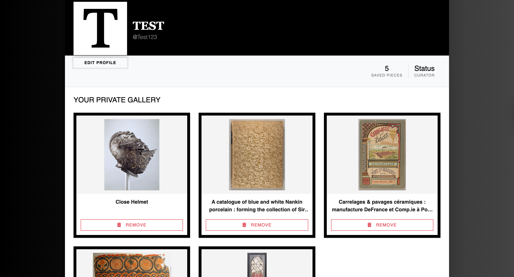
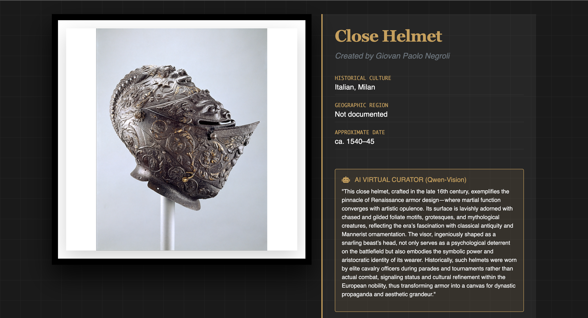
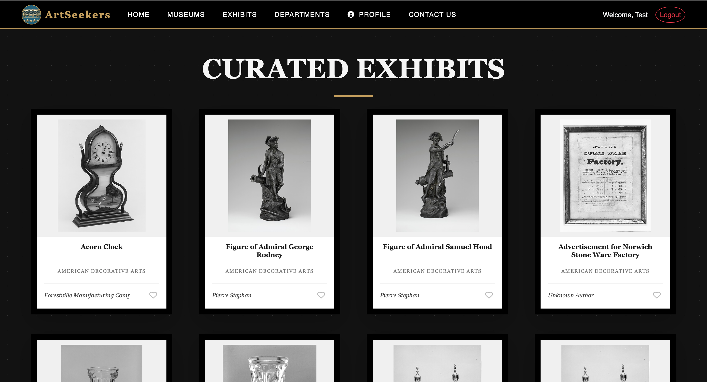

<div align="center">
  <h1>🖼️ ArtSeekers</h1>
  <p><strong>Full-stack museum explorer integrating classical art with multimodal AI</strong></p>
  
  <p>
    
    
    
  </p>
</div>

---

## 🎯 Live Demo
**https://artseekers-web.onrender.com/**

*Note: App may take 30-60 seconds to load on first visit (free tier spins down after inactivity)*

---

## 🌟 Project Overview

**ArtSeekers** is a full-stack gallery explorer for the **Metropolitan Museum of Art** collection. Originally developed as a collaborative bootcamp project, I independently refactored the entire system to implement algorithmic optimizations, multimodal AI integration, and production-grade security practices.

**Core capabilities:**
- Browse 10,000+ artworks with optimized performance
- AI-powered visual analysis using computer vision (Qwen-VL)
- Secure user authentication and personal collections
- Real-time artwork metadata from The Met's API

---

## 🚀 Engineering Highlights

### 1. Performance Optimization: O(N×M) → O(N+M)

**Challenge:** Initial implementation used nested loops for data serialization, resulting in O(N×M) complexity and slow page loads.

**Solution:** Refactored to use dictionary-based lookups:
```python
# Before: O(N×M) - nested iteration
for artwork in artworks:
    for metadata in all_metadata:
        if artwork.id == metadata.artwork_id:
            # process...

# After: O(N+M) - hash map lookup
metadata_map = {m.artwork_id: m for m in all_metadata}
for artwork in artworks:
    metadata = metadata_map.get(artwork.id)
    # process...
```

**Result:** Significantly reduced API response times, especially for large gallery queries.

### 2. Multimodal AI Integration (Qwen-VL)

**Implementation:**
- Integrated Hugging Face's Inference API with the Qwen-VL Vision model
- Sends artwork images to the model for visual analysis
- Processes multimodal input (image + text prompt) for context-aware responses
- Handles API rate limiting and error states gracefully

**Use case:** When users request insights about an artwork, the system:
1. Retrieves the artwork image URL
2. Sends image + prompt to Qwen-VL via Hugging Face API
3. Receives vision-based analysis of composition, style, and subject matter
4. Returns AI-generated curatorial description

### 3. Data Pipeline (ETL)

Built custom Python seeder (`popdb.py`) to populate database from The Met's public API:

**Features:**
- **Rate limiting:** Respects API constraints with configurable throttling
- **Data validation:** Filters records missing critical fields (image URLs, artist attribution)
- **Batch processing:** Handles large datasets efficiently
- **Error recovery:** Continues processing if individual records fail

### 4. Security Implementation

**Password Storage:**
- Implemented Scrypt hashing (CPU and memory-intensive to prevent brute force)
- Salt generation per user
- No plaintext password storage

**Authentication:**
- Session-based auth with JWT tokens
- Token refresh on page reload
- Secure cookie configuration

---

## 🛠️ Tech Stack

**Frontend:**
- React.js with Context API (Flux pattern)
- Bootstrap 5 for responsive design
- Session persistence with JWT

**Backend:**
- Python 3 + Flask
- SQLAlchemy ORM
- PostgreSQL (Neon) for production

**AI & External Services:**
- Hugging Face Inference API (Qwen-VL Vision model)
- Metropolitan Museum of Art REST API
- EmailJS for contact functionality

**Security:**
- Scrypt password hashing
- Environment-based configuration
- Session-based authentication

**Deployment:**
- Frontend: Render
- Database: Neon (PostgreSQL)

---

## ✨ Features

### Core Functionality
- Browse and search The Met's artwork collection
- Filter by artist, department, time period, and medium
- View detailed artwork metadata and high-resolution images
- User registration and authentication
- Personal favorites and collection curation
- Responsive design for all devices

### AI-Powered Analysis
- Integrated Qwen-VL multimodal vision model via Hugging Face API
- Analyzes artwork images to provide context-aware descriptions
- Real-time inference on artwork content and composition
- Combines visual analysis with metadata for richer insights

---

## 📸 Screenshots

### Gallery View

*Browse thousands of artworks with responsive grid layout*

### AI-Powered Analysis

*Qwen-VL Vision model providing real-time artwork insights*

### Artwork Details

*Comprehensive metadata and high-resolution images*

---

## 🔄 Project Evolution

This project began as a collaborative bootcamp effort at **4Geeks Academy** (team of 3). Following the bootcamp, I took full ownership of the codebase and independently:

- ✅ Refactored backend data handling for O(N+M) performance
- ✅ Integrated Qwen-VL multimodal AI for visual analysis
- ✅ Implemented Scrypt hashing and JWT authentication
- ✅ Built custom ETL pipeline with validation and throttling
- ✅ Optimized React state management with Context API
- ✅ Deployed to production with Render + Neon

---

## ⚙️ Quick Start

### Prerequisites
- Python 3.x
- Node.js & npm
- PostgreSQL (for production) or SQLite (for local dev)
- Hugging Face API key (for AI features)

### Installation
```bash
# Clone repository
git clone https://github.com/Aleska134/Artseekers.git
cd Artseekers

# Backend setup
pipenv install
pipenv shell

# Configure environment
cp .env.example .env
# Add your HUGGINGFACE_API_KEY and other config

# Seed database (optional - can take 10-15 minutes)
python src/popdb.py

# Start backend
python src/app.py

# Frontend setup (new terminal)
npm install
npm start
```

Visit `http://localhost:3000`

---

## 🧠 What I Learned

### Technical Skills
- **Algorithm optimization:** Identifying and resolving O(N×M) bottlenecks in production-style applications
- **AI integration:** Working with multimodal LLMs and managing API rate limits
- **ETL pipelines:** Building data processing workflows with validation and error handling
- **Security:** Implementing proper cryptographic hashing and authentication flows
- **Deployment:** Full-stack deployment with Render + Neon PostgreSQL

### Challenges Overcome
- **API rate limiting:** Had to implement smart throttling for The Met API during initial data seeding
- **Image processing:** Handling various image formats and sizes from external source
- **AI response handling:** Managing latency and error states for real-time AI inference
- **State management:** Coordinating complex state between React frontend and Flask backend
- **Production deployment:** Configuring separate hosting for frontend (Render) and database (Neon)

---

<hr />
<h2>👥 Original Team & Credits</h2>
<p>
  This project was originally conceived as a final group project at <b>4Geeks Academy</b>. 
  I would like to acknowledge my teammates <b>Erika Scott</b> and <b>Jose Dominguez</b> 
  for their contribution to the initial MVP.
</p>
<p>
  <i>Note: This specific version has been independently refactored and enhanced by me to include AI Multimodal integration, 
  backend optimizations ($O(N+M)$), and production deployment.</i>
</p>

<div align="center">
  <p><i>Developed and architected by <b>Aleska Braschi</b> | Computer Science @ MDC </i></p>
  
  <a href="https://www.linkedin.com/in/aleska-p-braschi">
    
  </a>
  <a href="https://github.com/Aleska134">
    
  </a>
</div>
