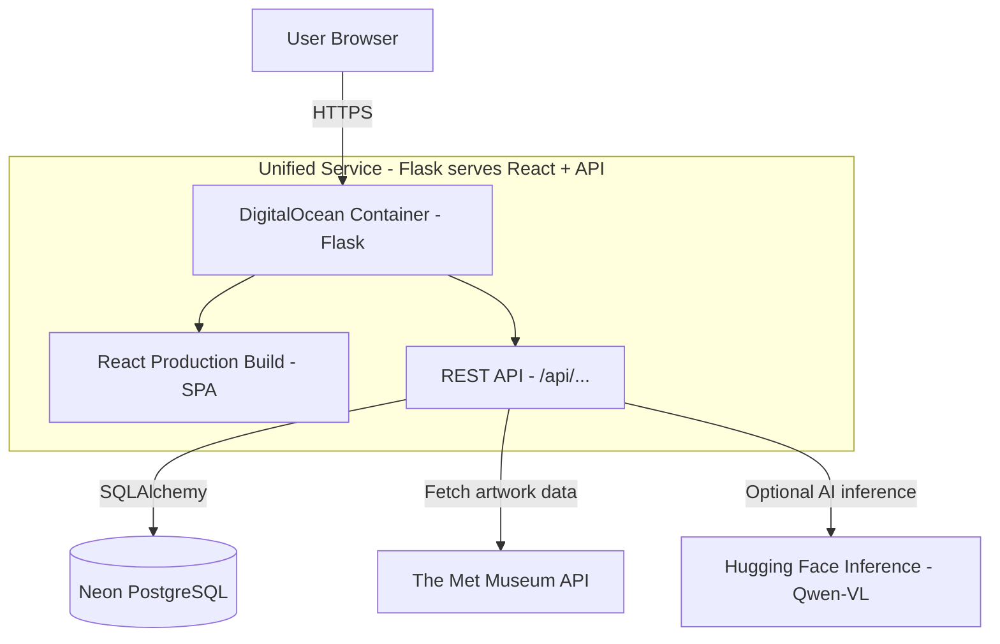
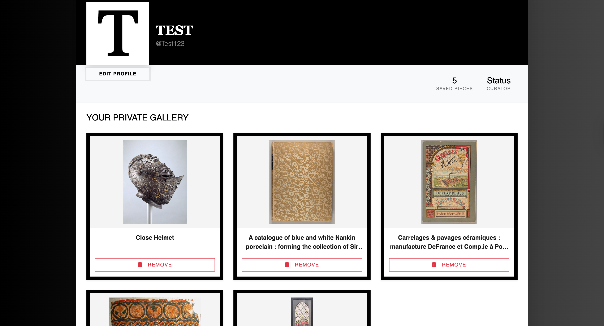
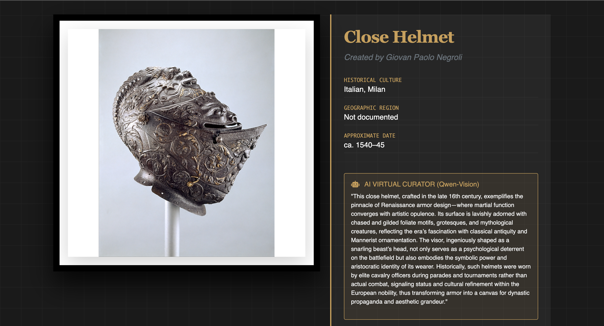
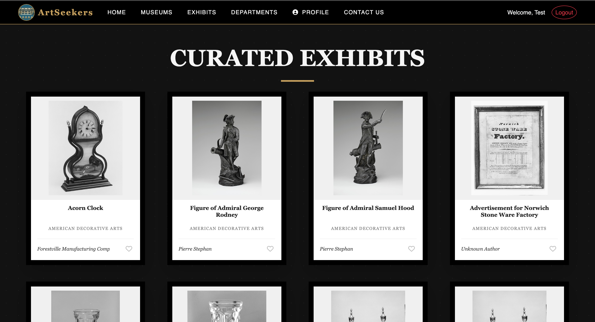

<div align="center">
  <h1>🖼️ ArtSeekers</h1>
  <p><strong>Full-stack museum explorer for The Met collection with multimodal AI artwork analysis</strong></p>

  <p>
    
    
    
    
    
  </p>

  <p>
    <a href="https://www.artseekers.dev/"><strong>Live Site</strong></a>
    •
    <a href="#quick-start"><strong>Quick Start</strong></a>
    •
    <a href="#system-design"><strong>System Design</strong></a>
    •
    <a href="#engineering-highlights"><strong>Engineering</strong></a>
  </p>
</div>

---

## 🎯 Live Demo
**https://www.artseekers.dev/**

---

## 🌟 Overview
**ArtSeekers** is a unified **Flask + React** application that explores the **Metropolitan Museum of Art** collection. Flask serves the React production build and handles all REST endpoints under **`/api/...`** (same domain, same origin).

**Core capabilities**
- Browse/search artworks from The Met API
- User authentication + favorites (stored in **Neon Postgres**)
- AI-powered artwork interpretation (multimodal vision)

---

## 🧩 System Design
Emphasis: **Flask ↔ Neon PostgreSQL ↔ The Met Museum API** (plus optional AI inference).


```mermaid
flowchart TB
  U[User Browser] -->|HTTPS| SVC[DigitalOcean Container - Flask]

  subgraph APP[Unified Service - Flask serves React + API]
    UI[React Production Build - SPA]
    API[REST API - /api/...]
    SVC --> UI
    SVC --> API
  end

  API -->|SQLAlchemy| DB[(Neon PostgreSQL)]
  API -->|Fetch artwork data| MET[The Met Museum API]
  API -->|Optional AI inference| HF[Hugging Face Inference - Qwen-VL]
```

---

<details>
<summary><strong>🧪 API Routes (examples)</strong></summary>

All API calls are same-origin under `www.artseekers.dev` and routed internally via `/api/...`.

| Route Pattern | Method(s) | Purpose | Integration |
|---|---:|---|---|
| `/api/auth/register` | `POST` | Create account | writes user record to **Neon Postgres** |
| `/api/auth/login` | `POST` | Authenticate | reads from **Neon Postgres** |
| `/api/auth/logout` | `POST` | End session | server-side session/token handling |
| `/api/me` | `GET` | Current user | reads from **Neon Postgres** |
| `/api/artworks` | `GET` | Browse/search artworks | fetches from **The Met API** |
| `/api/artworks/:id` | `GET` | Artwork details | fetches from **The Met API** |
| `/api/favorites` | `GET/POST` | List/add favorites | reads/writes **Neon Postgres** |
| `/api/favorites/:id` | `DELETE` | Remove favorite | deletes from **Neon Postgres** |
| `/api/ai/analyze` | `POST` | Artwork AI analysis | calls **Hugging Face inference** |
</details>

---

## 🛠️ Tech Stack
- **Frontend:** React, Bootstrap 5, Context API
- **Backend:** Python + Flask, SQLAlchemy
- **DB:** Neon PostgreSQL
- **External:** The Met Museum API, Hugging Face (Qwen-VL), EmailJS
- **Hosting:** DigitalOcean (containerized unified service)

---

## 🚀 Deployment (Current)
- **DigitalOcean** hosts a **containerized** unified service:
  - Flask serves the React build
  - Flask handles all `/api/...` endpoints under the same domain
- **Neon** provides managed PostgreSQL

---

## 📸 Screenshots
### Gallery View


### AI-Powered Analysis


### Artwork Details


---

## 🧠 Engineering Highlights

<details>
<summary><strong>1) Performance Optimization: O(N×M) → O(N+M)</strong></summary>

Refactored nested-loop serialization into hash map lookups to reduce latency on large queries.

```python
# Before: O(N×M)
for artwork in artworks:
    for metadata in all_metadata:
        if artwork.id == metadata.artwork_id:
            ...

# After: O(N+M)
metadata_map = {m.artwork_id: m for m in all_metadata}
for artwork in artworks:
    metadata = metadata_map.get(artwork.id)
    ...
```
</details>

<details>
<summary><strong>2) Multimodal AI Integration (Vision)</strong></summary>

Uses the artwork image + prompt → calls Hugging Face Inference API (Qwen-VL) → returns a curatorial-style explanation. Designed to fail gracefully on slow/failed inference.
</details>

<details>
<summary><strong>3) ETL / Seeding Pipeline</strong></summary>

`popdb.py` loads data from The Met API with validation + throttling + batch processing + error recovery.
</details>

<details>
<summary><strong>4) Security</strong></summary>

Scrypt password hashing + environment-driven configuration + JWT-based auth flow (per current implementation).
</details>

---

## ⚙️ Quick Start
### Prerequisites
- Python 3.x
- Node.js + npm
- PostgreSQL (recommended)
- Hugging Face API key (for AI features)

### Local setup
```bash
git clone https://github.com/Aleska134/Artseekers.git
cd Artseekers

pipenv install
pipenv shell

cp .env.example .env
# set DB URL, JWT secret, HUGGINGFACE_API_KEY, etc.

python src/popdb.py   # optional
python src/app.py

npm install
npm start
```

---

## 👥 Credits
Originally conceived as a final group project at **4Geeks Academy** (initial MVP with Erika Scott and Jose Dominguez).  
Refactored and enhanced by **Aleska Braschi** (performance, AI integration, security, and deployment).

<div align="center">
  <a href="https://www.linkedin.com/in/aleska-p-braschi">
    
  </a>
  <a href="https://github.com/Aleska134">
    
  </a>
</div>